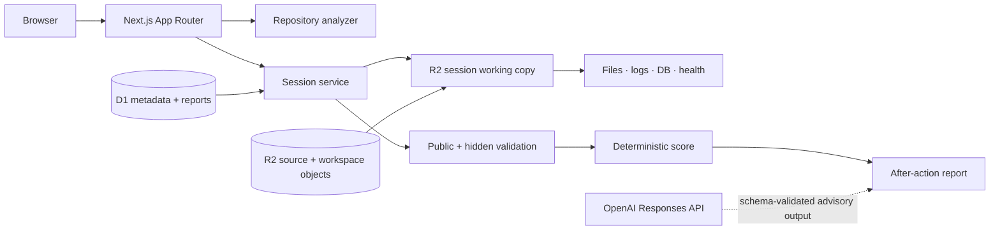

# RepoRehearsal

**Break it safely. Debug it seriously.**

RepoRehearsal analyzes a software repository, injects a realistic failure into an isolated copy, and trains developers to diagnose, repair, verify, and prevent production incidents. It is a Developer Tools hackathon project focused on incident-response practice—not automated bug fixing.

## The problem and solution

Developers often practice incident response for the first time during a real outage. Coding challenges teach implementation but rarely teach log correlation, state comparison, migration reasoning, or safe verification. RepoRehearsal supplies a repeatable incident loop based on a realistic codebase and scores the process as well as the patch.

## Main features

- Seeded TypeScript billing repository with realistic routes, migrations, fixtures, logs, health checks, and tests.
- Structural repository map with services, routes, data models, environment contracts, health checks, and ranked repairable incident boundaries.
- A repository brain that derives a per-session fault from the imported source instead of applying demo filenames to unrelated projects.
- Versioned database, configuration, and external-dependency incident templates.
- D1/R2-backed repository snapshots and per-session working copies with strict paths, opaque access tokens, expiry, deletion, and cleanup.
- IDE-style investigation workspace with editable code, logs, test results, database comparison, service health, hypotheses, hints, and timeline.
- Public checks, hidden repository-baseline contracts, unsafe-patch scanning, evidence-based scoring, and Markdown after-action reports.
- Deterministic validation and reporting that need neither an OpenAI key nor a private repository; configured OpenAI structured output can enhance coaching prose.
- Safe public GitHub repository import with strict URL, size, file-count, path, symlink, and submodule controls.
- Local folder and ZIP analysis with traversal, expansion, file-count, secret, binary, and generated-file controls.
- Optional ChatGPT, Google, or GitHub sign-in with persistent profiles, preferences, results, reusable repository snapshots, and real empty/history states.
- Interview mode with a visible countdown, disabled coaching, and interviewer-focused reporting.

## Architecture



The Sites deployment is a production serverless implementation: D1 stores authorization and lifecycle state, R2 stores filtered source snapshots and disposable working copies, and deterministic adapters model approved commands and evidence without executing untrusted uploads. A Dockerized billing fixture and `SandboxService` boundary remain available for teams that connect a dedicated hardened execution host. See [Architecture](docs/ARCHITECTURE.md) and [Security](docs/SECURITY.md).

## Supported stack

- Product: Next.js App Router, React, TypeScript, Tailwind CSS, Zod, Prisma schema, Vitest, Playwright.
- Demo repository: Express, TypeScript, PostgreSQL, Prisma, Docker Compose, Vitest.
- Full support: built-in billing demo and deterministic local incident loop.
- Upload support: public folder and ZIP analysis for supported text-based repositories. Arbitrary uploaded code is not executed on the web worker.

## Local setup

Requirements: Node.js 22.13 or newer. The interactive fallback needs no Docker, PostgreSQL, or OpenAI key.

```bash
cp .env.example .env
npm install --cache ./work/npm-cache
npm run demo:setup
npm run dev
```

Open `http://localhost:3000`, choose **Try demo incident**, inspect evidence, use the editable repair, run public tests, and submit.

For the full PostgreSQL demo repository on a Docker-capable host:

```bash
docker compose -f demo-repositories/billing-service/docker-compose.yml up --build
```

## Environment variables

Copy `.env.example`. `OPENAI_API_KEY` is optional and `OPENAI_MODEL` defaults to `gpt-5.6`. `CLEANUP_SECRET` protects the scheduled cleanup endpoint. Google and GitHub sign-in require their respective `*_OAUTH_CLIENT_ID` and `*_OAUTH_CLIENT_SECRET` values. Cloudflare supplies the D1 `DB` and R2 `REPOSITORIES` bindings. Never commit `.env` or OAuth credentials.

## Accounts and demo mode

No credentials are required to view public pages, complete the built-in incident, paste a public GitHub link, or upload a local codebase. Anonymous repository snapshots expire after 24 hours and are authorized by an opaque browser-session token. Sign in with ChatGPT, Google, or GitHub to save results, preferences, and reusable snapshots. RepoRehearsal accepts only verified provider emails, stores provider access tokens only in memory for the callback request, and persists only a provider subject plus a hashed application session token. Provider passwords and access tokens are never stored.

### OAuth callback URLs

Register web OAuth clients with these production callback URLs:

- Google: `https://repo-rehearsal.aryangaur926.workers.dev/auth/google/callback`
- GitHub: `https://repo-rehearsal.aryangaur926.workers.dev/auth/github/callback`

For local OAuth testing, create separate development clients with `http://localhost:3000/auth/google/callback` and `http://localhost:3000/auth/github/callback`. Set the four OAuth values as Cloudflare Worker secrets in production. Apply D1 migrations before deploying a version that enables these providers.

## How fault injection works

The clean billing fixture contains a valid `billingRegion` for every account. The main template creates an isolated incident state in which a partner-import path produces null regions after a required-column migration. The serializer then fails for only those records. Preparation records a clean baseline, applies the approved mutation, and verifies the expected 500 symptom before the workspace opens.

A safe repair must handle legacy data, update the secondary creation path, preserve the field constraint, and include a backfill/regression signal. Hardcoded sample fixes, disabled tests, blanket success responses, and removed constraints fail static or hidden validation.

For an uploaded folder, ZIP, or public GitHub repository, the repository brain scans the actual filtered source snapshot for supported behavior boundaries: container service hostnames, null-safe normalization, external-response guards, environment fallbacks, and repository-owned test/build commands. It ranks candidates by confidence, stores the selected baseline and mutation contract in the disposable session workspace, and changes only that session copy. If no safe repairable boundary exists, rehearsal creation stops truthfully instead of fabricating a challenge.

Submission compares the repaired workspace with the original snapshot and the selected behavior contract. Pass/fail requires the customer symptom to be repaired, the original structure to remain intact, the change scope to stay bounded, and unsafe bypasses to be absent. The 100-point score is separately derived from diagnosis, evidence gathered before editing, fix quality, verification commands, prevention/test changes, communication, and hint use. This makes two valid repairs capable of passing while receiving different readiness scores.

## Security model

- Source repositories are immutable inputs; sessions use copied workspaces.
- File reads/writes are contained using normalized absolute resolution.
- The browser submits command IDs; arbitrary command strings are never executed.
- Upload entries reject traversal, absolute paths, null bytes, and backslash variants.
- Logs redact API keys, database URLs, bearer tokens, and session secrets.
- Repository contents are untrusted prompt data and cannot change AI instructions.
- Hidden test source stays outside the exercise workspace.
- Active workspaces expire at the selected time limit, completed workspaces are deleted, imports are rate-limited, and cleanup is idempotent.

## OpenAI and Codex usage

GPT-5.6 may enhance architecture prose, hint wording, reasoning review, and reports through schema-validated structured output. Deterministic checks always control pass/fail, and the full demo works without an API key. Codex was used for architecture, UI implementation, fixture design, incident templates, test design, security review, and documentation. See [Codex usage](docs/CODEX_USAGE.md).

## Testing

```bash
npm run lint
npm run typecheck
npm test
npm run test:integration
npm run test:e2e
npm run build
npm run demo:verify
npm run sandbox:cleanup
```

## GitHub import

Open **Repositories** and enter a canonical public URL such as `https://github.com/owner/repository`. RepoRehearsal validates metadata, downloads a bounded branch archive from GitHub's fixed codeload host, excludes unsafe files, and stores the filtered snapshot in R2. It does not write to, fork, or modify the source. `GITHUB_TOKEN` is optional and only raises GitHub API rate limits; private repository access remains disabled.

## Local uploads

Open **Repositories** and select either a project folder or a ZIP archive. The request is limited to 20 MB expanded and 3,000 files. RepoRehearsal analyzes supported text files in memory, rejects unsafe paths, excludes generated directories, environment files, private keys, credential files, binaries, and oversized files, then stores the filtered snapshot in R2. Anonymous snapshots expire after 24 hours; signed-in snapshots can be reused and removed through the repository API/UI.

## Interview mode

Choose **Interview mode** while configuring a rehearsal. The workspace displays a countdown, disables coaching hints, records the result to the signed-in account, and changes the after-action report to an interviewer-oriented assessment of evidence use, verification, and communication.

## Known limitations

- Google and GitHub buttons remain disabled until both credentials for that provider are configured. OAuth clients must use an exact callback URL for the deployed origin.
- The hosted worker intentionally does not execute arbitrary uploaded commands. It validates repository-derived behavior contracts and source diffs; full native/container test execution requires a separate hardened sandbox service with network policy, quotas, patching, and audit logs.
- The workspace editor is a focused textarea implementation rather than Monaco.
- OpenAI report enhancement activates only when `OPENAI_API_KEY` is configured; deterministic validation and reports remain fully functional without it.

## Future work

Authorized private GitHub connections, account unlinking/deletion controls, organization-specific templates, team incident rooms, a hardened remote execution adapter, Kubernetes scenarios, and additional language adapters.

## Screenshots and demo

Run the application and use the three-minute path in [Demo script](docs/DEMO_SCRIPT.md). Add the final public video URL to the [submission checklist](docs/SUBMISSION_CHECKLIST.md).

## Hackathon submission

- Primary category: **Developer Tools**
- Secondary positioning: developer education, reliability training, onboarding, and incident-response practice.
- Submission copy: [Devpost description](docs/DEVPOST_DESCRIPTION.md)
- Judge readiness: [Submission checklist](docs/SUBMISSION_CHECKLIST.md)

## License

MIT. See [LICENSE](LICENSE).
