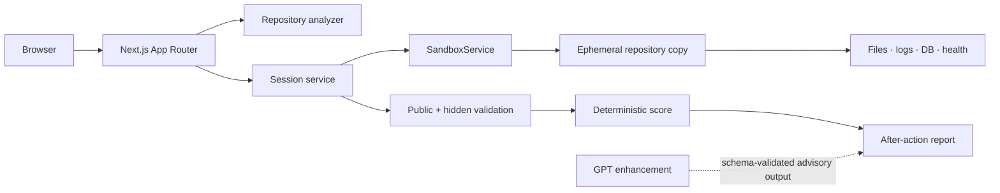

# RepoRehearsal

**Break it safely. Debug it seriously.**

RepoRehearsal analyzes a software repository, injects a realistic failure into an isolated copy, and trains developers to diagnose, repair, verify, and prevent production incidents. It is a Developer Tools hackathon project focused on incident-response practice—not automated bug fixing.

## The problem and solution

Developers often practice incident response for the first time during a real outage. Coding challenges teach implementation but rarely teach log correlation, state comparison, migration reasoning, or safe verification. RepoRehearsal supplies a repeatable incident loop based on a realistic codebase and scores the process as well as the patch.

## Main features

- Seeded TypeScript billing repository with realistic routes, migrations, fixtures, logs, health checks, and tests.
- Deterministic repository map and incident compatibility analysis.
- Versioned database, configuration, and external-dependency incident templates.
- Isolated workspace abstraction with strict paths, approved command IDs, expiry, and cleanup.
- IDE-style investigation workspace with editable code, logs, test results, database comparison, service health, hypotheses, hints, and timeline.
- Public tests, hidden behavioral checks, unsafe-patch scanning, scoring, and Markdown after-action reports.
- Deterministic fallback mode that needs neither an OpenAI key nor a private repository.

## Architecture



The current environment lacks Docker and PostgreSQL, so the included runnable demo uses the specification-approved local process adapter and seeded state. A production PostgreSQL Prisma schema and Dockerized billing fixture are included. See [Architecture](docs/ARCHITECTURE.md) and [Security](docs/SECURITY.md).

## Supported stack

- Product: Next.js App Router, React, TypeScript, Tailwind CSS, Zod, Prisma schema, Vitest, Playwright.
- Demo repository: Express, TypeScript, PostgreSQL, Prisma, Docker Compose, Vitest.
- Full support: built-in billing demo and deterministic local incident loop.
- Upload support: UI and security policies are present; hosted archive execution remains a documented limitation.

## Local setup

Requirements: Node.js 22.13 or newer. The interactive fallback needs no Docker, PostgreSQL, or OpenAI key.

```bash
cp .env.example .env
npm install --cache ./work/npm-cache
npm run demo:setup
npm run dev
```

Open `http://localhost:3000`, choose **Try demo incident**, inspect evidence, use the editable repair, run public tests, and submit.

For the full PostgreSQL demo repository on a Docker-capable host:

```bash
docker compose -f demo-repositories/billing-service/docker-compose.yml up --build
```

## Environment variables

Copy `.env.example`. `OPENAI_API_KEY` is optional. `OPENAI_MODEL` is read from configuration rather than hardcoded in product services. Sandbox limits default to 45 minutes, 1 CPU, and 1 GB memory. Never commit `.env`.

## Demo mode

No credentials are required. The seeded persona is **Maya Chen**, and historical sessions are preloaded in the dashboard. `DEMO_MODE=true` enables template summaries, hints, scoring, and reports without an API call.

## How fault injection works

The clean billing fixture contains a valid `billingRegion` for every account. The main template creates an isolated incident state in which a partner-import path produces null regions after a required-column migration. The serializer then fails for only those records. Preparation records a clean baseline, applies the approved mutation, and verifies the expected 500 symptom before the workspace opens.

A safe repair must handle legacy data, update the secondary creation path, preserve the field constraint, and include a backfill/regression signal. Hardcoded sample fixes, disabled tests, blanket success responses, and removed constraints fail static or hidden validation.

## Security model

- Source repositories are immutable inputs; sessions use copied workspaces.
- File reads/writes are contained using normalized absolute resolution.
- The browser submits command IDs; arbitrary command strings are never executed.
- Upload entries reject traversal, absolute paths, null bytes, and backslash variants.
- Logs redact API keys, database URLs, bearer tokens, and session secrets.
- Repository contents are untrusted prompt data and cannot change AI instructions.
- Hidden test source stays outside the exercise workspace.
- Workspaces expire and cleanup is idempotent.

## OpenAI and Codex usage

GPT-5.6 may enhance architecture prose, hint wording, reasoning review, and reports through schema-validated structured output. Deterministic checks always control pass/fail, and the full demo works without an API key. Codex was used for architecture, UI implementation, fixture design, incident templates, test design, security review, and documentation. See [Codex usage](docs/CODEX_USAGE.md).

## Testing

```bash
npm run lint
npm run typecheck
npm test
npm run test:integration
npm run test:e2e
npm run build
npm run demo:verify
npm run sandbox:cleanup
```

## Known limitations

- The runnable hackathon environment uses in-process seeded state because Docker and PostgreSQL are unavailable here.
- ZIP execution, authentication, GitHub import, multi-user persistence, and arbitrary repositories are not enabled in the hosted demo.
- The workspace editor is a focused textarea implementation rather than Monaco.
- Secondary templates use the shared deterministic workflow; the database migration path is the most polished.

## Future work

GitHub import, organization-specific templates, team incident rooms, Kubernetes scenarios, runbook validation, interview mode, progression analytics, and additional language adapters.

## Screenshots and demo

Run the application and use the three-minute path in [Demo script](docs/DEMO_SCRIPT.md). Add the final public video URL to the [submission checklist](docs/SUBMISSION_CHECKLIST.md).

## Hackathon submission

- Primary category: **Developer Tools**
- Secondary positioning: developer education, reliability training, onboarding, and incident-response practice.
- Submission copy: [Devpost description](docs/DEVPOST_DESCRIPTION.md)
- Judge readiness: [Submission checklist](docs/SUBMISSION_CHECKLIST.md)

## License

MIT. See [LICENSE](LICENSE).
