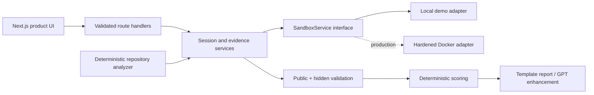

# RepoRehearsal architecture

RepoRehearsal is a Next.js App Router application deployed through the Sites-compatible Vinext runtime. The hackathon build uses a deterministic in-process demonstration adapter because Docker and PostgreSQL are unavailable in this environment. The adapter implements the same boundaries as the planned Docker adapter: immutable source, per-session copied workspaces, approved command IDs, path containment, expiration, evidence recording, deterministic fault injection, and hidden validation.

## Trust boundaries

- Repository contents and uploads are untrusted data.
- The original repository is never an execution workspace.
- Browser clients submit command IDs, never shell strings.
- File access is normalized and checked against the session root.
- Hidden test definitions remain outside the copied exercise workspace.
- AI output is advisory and schema-validated; deterministic checks decide pass/fail.

## Current environment limits

- Docker: unavailable.
- PostgreSQL CLI/server: unavailable.
- Active adapter: deterministic local demonstration adapter.
- Persistence: seeded, process-local demo state; the production Prisma schema is included for PostgreSQL deployment.

## Vertical slice

The seeded billing repository is analyzed, copied into a session, faulted with `db-required-field-migration-v1`, investigated through files/logs/database evidence, repaired in the editor, and evaluated by public checks, hidden checks, static policy checks, scoring, and a Markdown after-action report.
