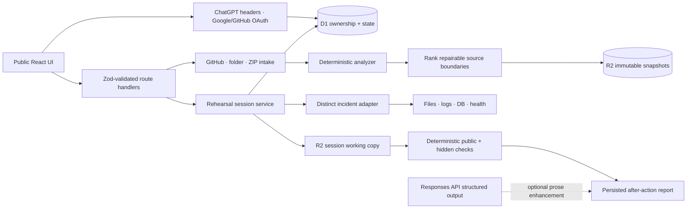

# RepoRehearsal architecture

RepoRehearsal is a public Next.js App Router application deployed through the Sites-compatible Vinext runtime. ChatGPT, Google, and GitHub sign-in are optional. D1 stores accounts, linked identities, hashed application sessions, one-time OAuth attempts, repository authorization, rehearsal state, timelines, validation, reports, and rate-limit windows. R2 stores filtered repository snapshots and one disposable working-copy object per active rehearsal.

## Request lifecycle

1. Intake validates paths, types, file count, and expanded size, excludes secrets/generated content, and stores an immutable filtered snapshot.
2. Creating a rehearsal authorizes that snapshot by account ownership or a hashed opaque token and immediately copies it to a session-specific R2 object.
3. For imported repositories, the repository brain ranks real source boundaries and stores a serializable incident blueprint containing the selected target, known-good contract, source hashes, evidence, and hints. Preparation applies exactly one mutation to the working copy. Built-in cases continue to use their versioned adapters.
4. During an active session, all reads, writes, evidence, hypotheses, hints, and approved command IDs pass through authorized server routes and are recorded in D1.
5. Submission validates the repaired behavior contract, baseline structure, unsafe-bypass policy, and change scope. A separate 100-point rubric scores diagnosis, investigation, fix quality, verification, prevention, communication, and hint independence. Optional OpenAI output can rewrite coaching fields only.
6. The report remains durable; the working-copy object is deleted after submission or expiry.

## Trust boundaries

- Repository contents and model-visible data are untrusted.
- OAuth state, PKCE verifiers, provider secrets, and provider tokens remain server-side; only HttpOnly opaque session cookies reach the browser.
- Access tokens are returned once, stored only in browser session storage, and hashed before D1 persistence.
- Browser clients submit fixed command IDs, never shell strings or argv.
- Hidden checks remain server-side and only return results after submission.
- The hosted adapter does not execute arbitrary uploaded code or permit repository-controlled network access.
- A future real execution adapter must live on a dedicated sandbox host behind the existing `SandboxService` contract.

## Supported production surface

The hosted product supports the four built-in cases plus generated incidents for compatible JavaScript/TypeScript repositories. Current source adapters detect container host contracts, null-safe normalization, fetch response guards, environment fallbacks, and test/build scripts. The worker does not execute repository-controlled commands; a future native adapter remains isolated behind `SandboxService`. ChatGPT works through trusted hosting headers; Google and GitHub work when their Worker secrets and exact callback URLs are configured. OAuth sign-in does not grant private-repository access; public GitHub URL import remains fully supported.
