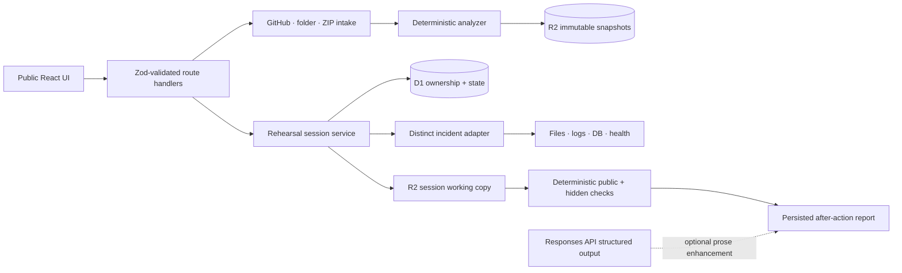

# RepoRehearsal architecture

RepoRehearsal is a public Next.js App Router application deployed through the Sites-compatible Vinext runtime. ChatGPT sign-in is optional. D1 stores accounts, repository authorization, rehearsal state, timelines, validation, reports, and rate-limit windows. R2 stores filtered repository snapshots and one disposable working-copy object per active rehearsal.

## Request lifecycle

1. Intake validates paths, types, file count, and expanded size, excludes secrets/generated content, and stores an immutable filtered snapshot.
2. Creating a rehearsal authorizes that snapshot by account ownership or a hashed opaque token and immediately copies it to a session-specific R2 object.
3. Preparation overlays exactly one versioned scenario fault without modifying the stored source.
4. During an active session, all reads, writes, evidence, hypotheses, hints, and approved command IDs pass through authorized server routes and are recorded in D1.
5. Submission runs scenario-specific deterministic validation. The score and pass/fail result are authoritative. Optional OpenAI output can rewrite coaching fields only.
6. The report remains durable; the working-copy object is deleted after submission or expiry.

## Trust boundaries

- Repository contents and model-visible data are untrusted.
- Access tokens are returned once, stored only in browser session storage, and hashed before D1 persistence.
- Browser clients submit fixed command IDs, never shell strings or argv.
- Hidden checks remain server-side and only return results after submission.
- The hosted adapter does not execute arbitrary uploaded code or permit repository-controlled network access.
- A future real execution adapter must live on a dedicated sandbox host behind the existing `SandboxService` contract.

## Supported production surface

The hosted product supports all three incident categories—database migration, container configuration, and provider schema drift—with distinct faults, evidence, target files, and checks. ChatGPT is the only configured identity provider exposed by Sites. Google/GitHub OAuth and private GitHub installation flows require hosting capabilities that are not currently available; public GitHub URL import remains fully supported.
